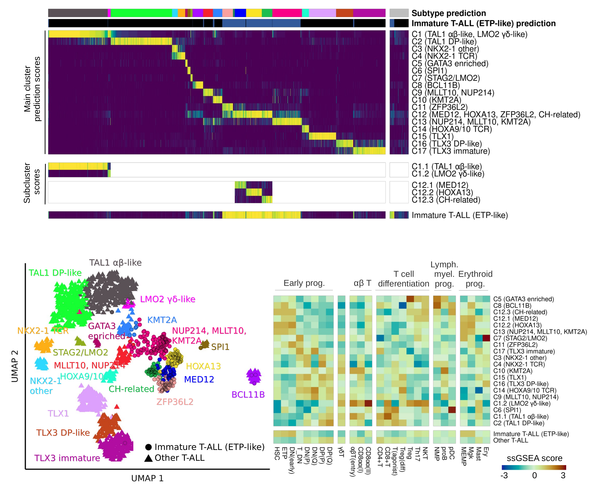
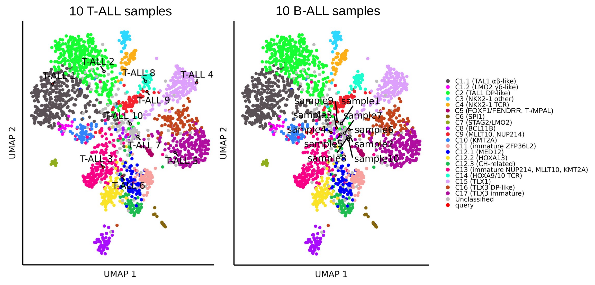

# ALLCatchR2
**ALLCatchR** was developed to predict 42 acute lymphoblasctic leukemia subtypes based on gene expression count data. The B-ALL subtype classifier module was described in original ALLCatchR publications:
- https://doi.org/10.1182/blood.2023021752 (https://github.com/ThomasBeder/ALLCatchR)
- https://doi.org/10.1097/HS9.0000000000000939 (https://github.com/ThomasBeder/ALLCatchR_bcrabl1)

# T-ALL subtype classification
The T-ALL subtype  prediction module of ALLCatchR was established on 2,314 T-ALL samples from 15 cohorts (age: 0.8-90.08) and is able to predict 20 T-ALL gene expression subtypes and a driver overarching definition of immature T-ALL (ETP-like):
- https://library.ehaweb.org/eha/2025/eha2025-congress/4159185/thomas.beder.a.gene.expression.based.machine.learning.classifier.robustly.html?f=listing%3D4%2Abrowseby%3D8%2Asortby%3D2%2Amedia%3D3%2Aspeaker%3D1045302 



## Installation
open RStudio
install devtools and follow the installion guide https://github.com/r-lib/devtools
```
if (!require("devtools", quietly = TRUE))
  install.packages("devtools")
```
install ALLCatchR2
```
devtools::install_github("ThomasBeder/ALLCatchR2")
```

## Quickstart
If Counts.file is left ```NA``` ten B-ALL test samples are predicted
```
library(ALLCatchR2)
out <- allcatchr_1.1()
```

## Run T-ALL subtype classification
As input ALLCatchR2 requires a single text file in which the first column are the gene symbols/IDs and the other columns the count data for each sample

  - T-ALL subtype classification
```
library(ALLCatchR2)
out <- allcatchr_1.1(Lineage = "T-ALL", Counts.file = NULL, ID_class = "symbol", sep = "\t", out.file = "/path", plot.path = "/path")
Arguments:
- Lineage	= disease Lineage c("B-ALL","T-ALL")
- Counts.file	= count data provided as data frame object with genes in rows and samples in columns or a path to a text file
- ID_class	= gene ids used; c("symbol","ensembl_ID","entrez_ID")
- sep = c("\t", " ", ",", ";")
- out.file	= path and filename of the results table
- plot.path	= for each sample a bar chart with the prediction scores for the individual T-ALL subtypes is generated, this is the path where the plots should be saved
```

The T-ALL classification module creates two data frames in ```out``` one with expression for certain T-ALL marker genes and one with the prediction results.
The prediction results contain the following columns:
- sample: Sample ID
- 2-24 Scores: T-ALL subtype main- and sub-cluster predicitons scores
- 25-30 Predicitons: high-confidence and candidate level predictions for main-, sub-cluser and immature T-ALL (ETP-like)
- BC_pred: Blast count predictions score
- 32-57: ssGSEA to T-cell and hematopoietic developmental stages. Gene sets were defined from scRNA-seq data of thymic and hematopoietic cell types (https://www.science.org/doi/10.1126/science.aay3224)
- panHSPC, BMPlike_119: Recent studies have identified bone marrow progenitor (BMP)-like subpopulations in T-ALL and hematopoietic stem/progenitor cell-like (HSPC-like) populations across leukemias             associated with chemoresistance and poor outcomes. In this columns ssGSEA results to the gene sets defined for these populations as well as their percentile across all T-ALL samples are shown.


## Run acute leukemia lineage classification
ALLCatchR lineage classifier predicts B-ALL and T-ALL lineage 

```
library(ALLCatchR2)
out <- allcatchr_lineage(Counts.file = NULL, ID_class = "symbol", sep = "\t", out.file = "/path")
Arguments: same as in allcatchr_1
```

The lineage classification module creates a data frame in ```out``` with the following columns:
- sample: Sample ID
- B-ALL	and T-ALL prediction scores
- lineage prediction

## T-ALL UMAP projection
Thie function projects T-ALL samples based on count data onto umap model

```
library(ALLCatchR2)
out <- allcatchr_projectTALL(Counts.file=NULL, ID_class="symbol", 
                                  sep="\t", 
                                  out.file="/path/to/TALL_projection.tsv"), 
                                  plot.file = "/path/to/TALL_projection.png"),
                                  plot.width = 8, 
                                  plot.height = 6,
                                 label.size = 3)
Arguments: same as in allcatchr_1
- plot.width = width of the UMAP plot in inch
- plot.height = height of the UMAP plot in inch
- label.size = size of query samples lables derived from ggrepel

```

The UMAP projection function module creates a data frame in ```out``` with the UMAP coordinates for each query sample and a UMAP plot.
- T-ALL samples are projected in accordance to T-ALL subtypes. Low blast count samples are often unclassfied and tend to group towards the center of the UMAP plot. For comparison also projection of 10 B-ALL samples are shown that group all to the center of with the unclassified samples.


